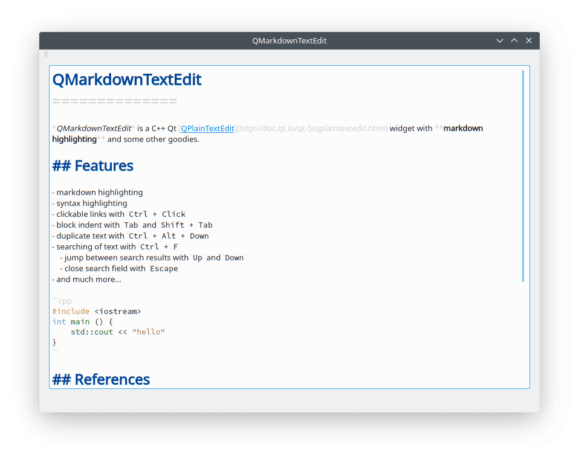

# [QMarkdownTextEdit](https://github.com/pbek/qmarkdowntextedit)
[](https://github.com/pbek/qmarkdowntextedit/actions)
[](https://travis-ci.org/pbek/qmarkdowntextedit)
[](https://ci.appveyor.com/project/pbek/qmarkdowntextedit)

QMarkdownTextEdit is a C++ Qt [QPlainTextEdit](http://doc.qt.io/qt-5/qplaintextedit.html) widget with [markdown](https://en.wikipedia.org/wiki/Markdown) highlighting and some other goodies.

## Widget Features
- Markdown highlighting
- Code syntax highlighting
- Clickable links with `Ctrl + Click`
- Block indent with `Tab` and `Shift + Tab`
- Duplicate text with `Ctrl + Alt + Down`
- Searching of text with `Ctrl + F`
    - Jump between search results with `Up` and `Down`
    - Close search field with `Escape`
- Replacing of text with `Ctrl + R`
    - You can also replace text with regular expressions or whole words
- Line numbers (Qt >= 5.5)
- Very fast
- And much more...

## Supported Markdown Features
Commonmark compliance is enforced where possible however we are not fully Commonmark compliant yet. Following is a list of features/extensions supported by the highlighter. Please note that this is just a plaintext editor and as such, it only does the highlighting and not rendering of the markdown to HTML.

| Feature                                                                                 | Availablity                                          |
| --------------------------------------------------------------------------------------- | ---------------------------------------------------- |
| Bolds and Italics                                                                       | Yes                                                  |
| Lists (Unordered/Orderered)                                                             | Yes                                                  |
| Links and Images<br/>(Inline/Reference/Autolinks/E-mail)                                | Yes (Cannot handle nested links or complex cases yet) |
| Heading (ATX and Setext)                                                                | Yes                                                  |
| Codeblocks (indented and fenced)<br/> Both backtick and tilde code fences are supported | Yes (Only fenced code block has syntax highlighting) |
| Inline code                                                                             | Yes                                                  |
| Strikethrough                                                                           | Yes                                                  |
| Underline                                                                               | Yes (Optional)                                       |
| Blockquotes                                                                             | Yes                                                  |
| Table                                                                                   | Yes                                                  |


## Screenshot


## Usage

There are multiple ways to use this. You can use the editor directly, or you can subclass it or you can just use the highlighter.
### Using the editor

#### QMake
- Include [qmarkdowntextedit.pri](https://github.com/pbek/qmarkdowntextedit/blob/develop/qmarkdowntextedit.pri) 
  to your project like this `include (qmarkdowntextedit/qmarkdowntextedit.pri)`
- add a normal `QPlainTextEdit` to your UI and promote it to `QMarkdownTextEdit` (base class `QPlainTextEdit`)

#### CMake
- Include [CMakeLists.txt](https://github.com/pbek/qmarkdowntextedit/blob/develop/CMakeLists.txt)
  to your project like this `add_subdirectory(qmarkdowntextedit)`
- add a normal `QPlainTextEdit` to your UI and promote it to `QMarkdownTextEdit` (base class `QPlainTextEdit`)


### Using the highlighter only
Highlighter can work with both `QPlainTextEdit` and `QTextEdit`. Example:
```cpp
auto doc = ui->plainTextEdit->document();
auto *highlighter = new MarkdownHighlighter(doc);
```

## Projects using QMarkdownTextEdit
- [QOwnNotes](https://github.com/pbek/QOwnNotes)
- [Notes](https://github.com/nuttyartist/notes)
- [CuteMarkEd-NG](https://github.com/Waqar144/CuteMarkEd-NG)


## Disclaimer
This SOFTWARE PRODUCT is provided by THE PROVIDER "as is" and "with all faults." THE PROVIDER makes no representations or warranties of any kind concerning the safety, suitability, lack of viruses, inaccuracies, typographical errors, or other harmful components of this SOFTWARE PRODUCT. 

There are inherent dangers in the use of any software, and you are solely responsible for determining whether this SOFTWARE PRODUCT is compatible with your equipment and other software installed on your equipment. You are also solely responsible for the protection of your equipment and backup of your data, and THE PROVIDER will not be liable for any damages you may suffer in connection with using, modifying, or distributing this SOFTWARE PRODUCT.
